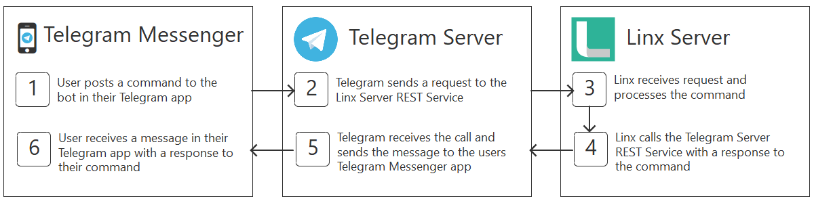

# Linx TelegramBot Solution

## Description
The backend for a simple Telegram Bot that generates random strings of any length

## Diagram
A diagram of how Linx, the Telegram API and a Messenger app will interact

## Prerequisites
1. Download and install the Linx Designer https://linx.software/download-linx/ 
1. Pull the "Linx 6 Solution" folder from this repo
1. Sign up for a free Linx Trial Server https://linx.software/pricing/
1. Install the Telegram Messenger on your phone (iPhone or Android)

## Bot Registration
1. Go to the @Botfather channel in your Telegram Messenger app (https://telegram.me/BotFather)
1. Click ‘Start’
1. Send /newbot
1. Enter a name for your bot
1. Enter a username
1. Send /token to get your bot token

## Linx Designer
1. Open the Linx Designer and open the TelegramBot.solution file in the repo folder
1. Open the solution Settings by clicking the Settings button in the Linx Designer top toolbar
1. Locate the TelegramToken setting and paste the token you received from Telegram in the value field
1. Check the email you received when signing up to the Linx Server Trial. Here you can find the name in the server URL (for example, in this url \https://scqcpc33.linx.twenty57.net the server name is ‘scqcp33’). In the value field of the APIBaseUri setting, replace the xxx (\https://xxx.api.linx.twenty57.net/) with the name of your server. 
1. Register the Webhook by running the SetWebhook function in the Linx Designer. 
   1. Open the Telegram and WebHookUtils folders in the Linx solution
   2. Right-click on the SetWebhook function and select ‘Debug’
   3. Click ‘Start’ to execute the function. The Debug Output panel should show ‘Function started’ and ‘Function finished’
2. Now deploy the solution to your Linx Server by clicking the Deploy button in the Linx Designer 
   1. Add your server in the deploy popup (as per the server email you received)
   2. Hit the ‘Deploy & Open Server’ button. The server will open in a browser window when the upload is done. 
   3. Log into your server using the credentials from your trial server email
   4. Click on the TelegramBot solution
   5. Select the Settings menu item in the left-hand menu and change the value for APIBaseUrl to: https://+:8080/
   6. Select the Services menu item in the left-hand menu and switch on the service in the next screen

You are done setting up your bot in Linx. 

## Your Telegram Bot
Now open your bot in your Telegram Messenger and try it out! 

Your bot will respond to any of the commands built into the ‘ProcessMessage’ function in the ‘Service’ folder of the TelegramBot solution. 
1. /start
1. /help
1. /random or /random12

You can add more commands by selecting the ‘HandleCommands’ component in the ‘ProcessMessage’ function and selecting the [...] button on the ‘Conditions’ property. 

The ‘HandleCommands’ component represents an If/Else statement. You can add a new condition to the list. This will provide you with an execution path, like the paths for start, help and random where you can define what you want to do when the condition is met. 